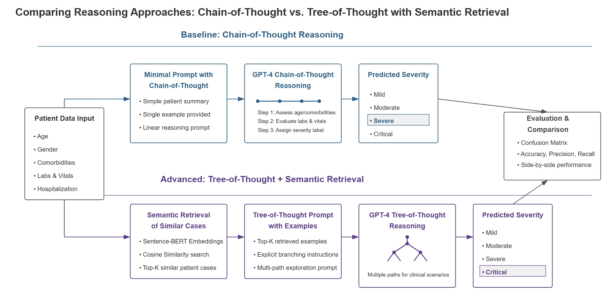
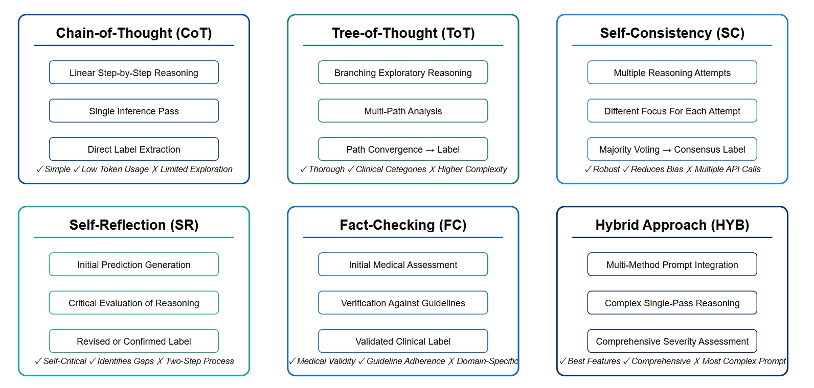
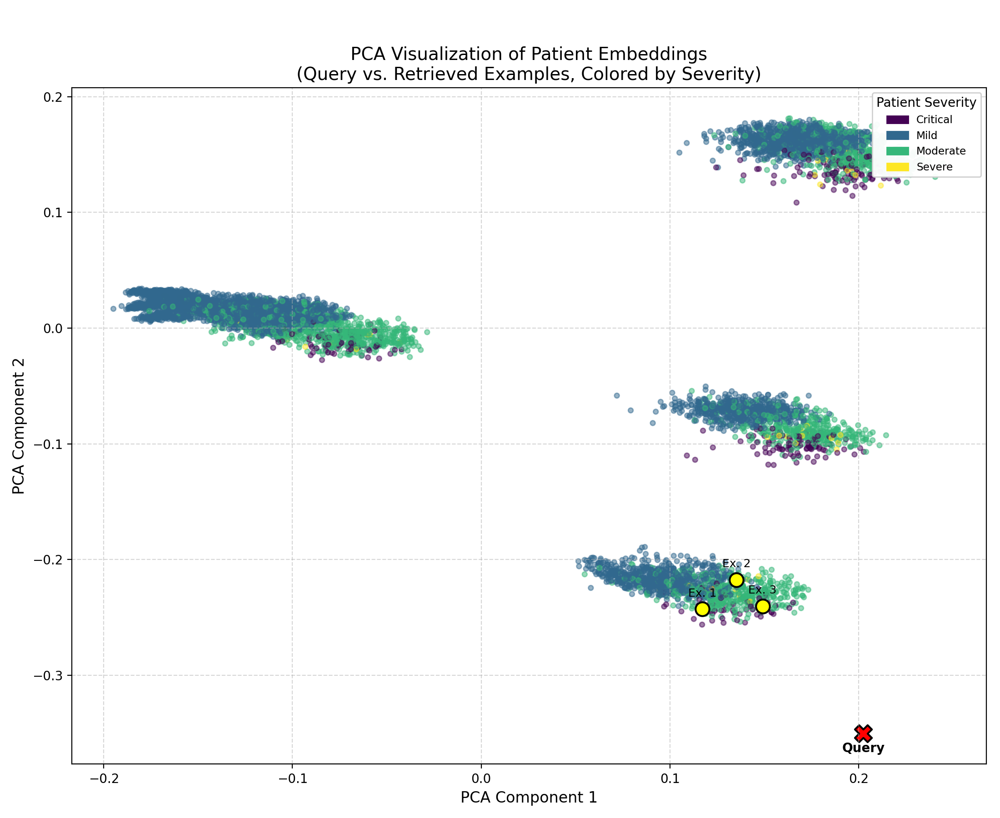
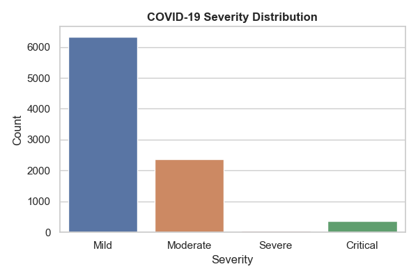
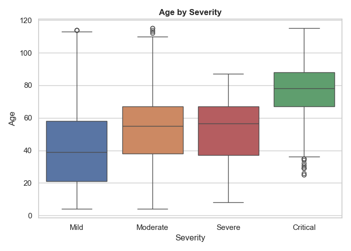
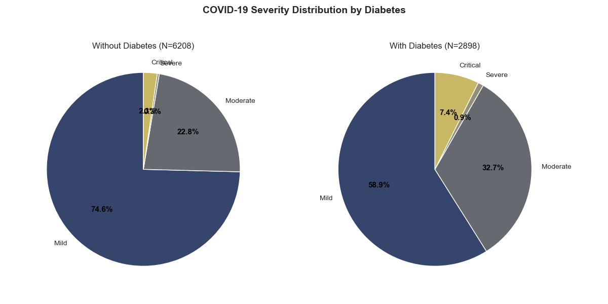
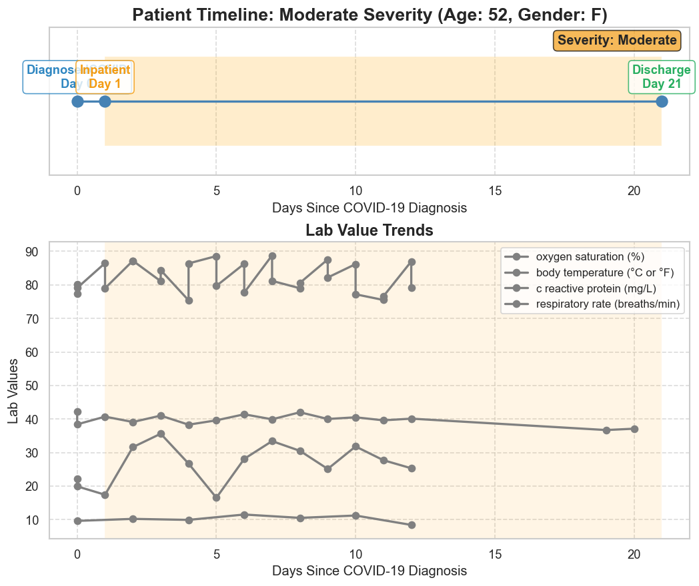
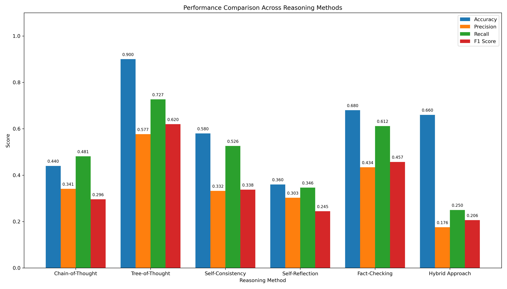
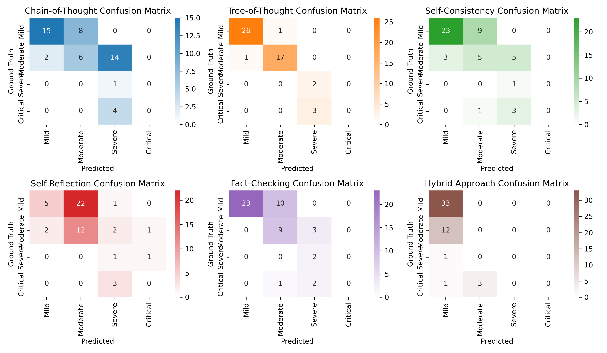
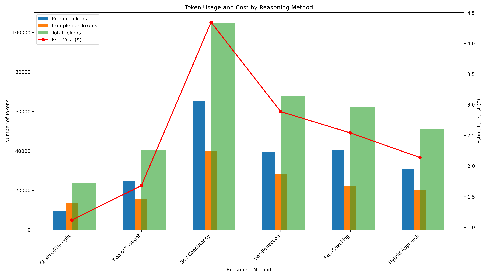

# LLM_CoT-ToT_Prompt-Engineering-Pipeline

## Abstract
Large-language models (LLMs) can reason over rich clinical data, but their predictive power depends strongly on the *structure* of the prompts they receive. This repository introduces a fully reproducible pipeline that couples **semantic retrieval** with two advanced prompting paradigms—**Chain-of-Thought (CoT)** and **Tree-of-Thought (ToT)**—to classify COVID-19 severity on >10 k synthetic patient records generated by **Synthea**. Patient summaries are embedded with Sentence-BERT, enabling retrieval of the *k* most similar cases that seed few-shot prompts.

Quantitative evaluation shows that adding retrieval plus ToT branching yields sizable performance gains: overall accuracy climbs from **0.44 → 0.90**, and the macro-F1 for minority classes (Severe + Critical) more than **doubles** compared with a minimal CoT baseline. Despite a ~20 % increase in tokens, ToT delivers **≈1.6× higher accuracy per 1 k tokens**, establishing the best cost–performance trade-off among six reasoning methods tested. Visual analyses—severity distributions, age-risk trends, diabetes impact, PCA embedding clusters, and token-usage plots—corroborate these findings and illustrate the clinical interpretability of structured LLM reasoning. Collectively, the results demonstrate that **methodical prompt design and contextually relevant exemplars are decisive for reliable, interpretable clinical predictions**.

---

## Project Objectives
1. **Demonstrate Advanced Prompt Engineering**
   Combine Chain-of-Thought and Tree-of-Thought approaches to guide LLM reasoning step by step.

2. **Explore Multi-Step Reasoning & Semantic Retrieval**
   Employ Sentence-BERT retrieval to find contextually similar patients as few-shot examples, enhancing LLM output reliability.

3. **Quantify Performance on COVID-19 Severity Prediction**
   Evaluate how well different prompt methods classify synthetic patient severity levels (Mild → Critical).

4. **Facilitate Interpretability & Clinical Relevance**
   Present structured LLM outputs that clinicians can examine to understand model decision pathways and logic.

---

## System Requirements & Dataset Considerations

### Synthea COVID-19 Dataset
- **Data Source**: [Synthea](https://github.com/synthetichealth/synthea) with its COVID-19 module producing realistic (but synthetic) patient records (demographics, conditions, labs, medications, encounters, etc.).
- **Clinical Fields**: Encounters, Observations, Conditions, relevant procedure codes (e.g., ventilation).
- **Severity Labels**: Derived from outcomes such as ICU admission and mortality.
- **Data Volume**: Hundreds → tens-of-thousands of synthetic patient records, exportable as CSV or FHIR resources.

### Computational Environment
| Resource | Recommended |
|----------|-------------|
| **GPU**  | NVIDIA RTX 4070-class for Sentence-BERT & GPT-4 batches |
| **Python** | 3.10 + (`sentence-transformers`, `torch`, `openai`, `pandas`, `numpy`, `scikit-learn`, `matplotlib`, `seaborn`, `networkx`, `tqdm`) |
| **System RAM** | 16 GB for ≤10 k patients; 32 GB for full self-consistency sweeps |

### Data Usage
- **Synthetic Data**: No PHI—freely distributable, yet realistically structured.
- **Scalability**: Larger exports (10 k +) require efficient merges and GPU batching.

---

## Project Workflow Overview

1. **Data Ingestion & Pre-processing** – load CSVs, derive severity labels.
2. **Semantic Retrieval** – Sentence-BERT embeddings to fetch top-*k* similar patients.
3. **Prompt Engineering** – CoT vs ToT prompts feed GPT-4.
4. **Inference & Evaluation** – accuracy / F1, confusion matrix, token costs.
5. **Interpretability** – visualise rationales & lab-trend plots.

*Figure 1: Comparative workflow illustrating baseline CoT versus the advanced ToT approach enhanced with semantic retrieval.*
In this workflow visualization, I compare two distinct prompting techniques implemented for GPT-4 to predict COVID-19 severity. The upper baseline approach employs a linear "Chain-of-Thought," where GPT-4 sequentially assesses patient characteristics from a minimal patient summary. The lower, advanced method integrates semantic retrieval—employing Sentence-BERT embeddings and cosine similarity—to select contextually relevant patient cases. This contextual foundation feeds into a "Tree-of-Thought" reasoning approach, where GPT-4 explores multiple, explicitly branched reasoning paths before converging on a final severity classification. These parallel methods were designed to rigorously evaluate how semantic retrieval and structured branching impact clinical decision accuracy, clarity of explanations, and overall reliability in predictive modeling.

---
### Prompt‑Engineering Concepts  

*Figure 2: Quick‑reference map of the six reasoning paradigms benchmarked in this project (CoT, ToT, SC, SR, FC, HYB).*
This schematic summarizes the unique workflow logic, strengths, and trade-offs associated with each prompting paradigm evaluated in the pipeline. **Chain-of-Thought (CoT)** offers a lightweight, single-pass approach but lacks deeper exploration. **Tree-of-Thought (ToT)** incorporates branching analysis that captures greater clinical nuance, though it requires additional tokens. **Self-Consistency (SC)** addresses stochastic bias by generating multiple focused outputs followed by majority voting, while **Self-Reflection (SR)** introduces a second reasoning pass to audit and revise the initial chain when needed. **Fact-Checking (FC)** cross-references predictions with guideline-based criteria to reinforce domain validity. The **Hybrid Approach (HYB)** combines the strongest elements of all preceding methods into a single, unified prompt, delivering the most comprehensive—though computationally demanding—severity assessment. Presenting these six paradigms side-by-side clarifies the trade-offs between simplicity, robustness, clinical rigor, and full-coverage reasoning, and serves as a visual guide for interpreting the results that follow.

---

## Methodological Framework

1. **Data Pipeline**
   - **Merging & Labeling**: per-patient table with final severity.
   - **RoBERTa Embeddings**: vectorisation for semantic retrieval.

2. **Few-Shot Retrieval**
   - Weighted sampling ensures minority classes (Severe, Critical) surface among exemplars.
   - *k*-NN similarity in embedding space selects best examples.

*Figure 3: PCA projection of patient embeddings, showing distinct clusters by severity and the proximity of retrieved exemplars to a query case.*
The PCA visualization of patient embeddings clearly shows semantic clustering that aligns with COVID-19 severity labels. Retrieved exemplars, identified in relation to a query patient case, are positioned nearby in the embedding space, indicating that semantic similarity was effectively captured. Embedding-based retrieval, which uses Sentence-BERT and cosine similarity, selected semantically relevant cases that directly support the advanced "Tree-of-Thought" approach. This method contextualizes reasoning prompts with clinically similar patient profiles, as confirmed by the distinct severity-based clustering patterns. The embeddings were used to quantitatively validate semantic similarity, highlighting the technical effectiveness of embedding-driven few-shot exemplar selection.

3. **Prompt Construction**
   - **Chain-of-Thought**: linear reasoning (step 1 → step N → conclusion).
   - **Tree-of-Thought**: parallel branches (respiratory / comorbidities / demographics) then converge.

4. **Evaluation Metrics**
   - Accuracy, precision, recall, F1.
   - Subgroup analysis (age, comorbidity).
   - Token usage for cost tracking.

---

## Exploratory Data Analysis & Interpretability

### Overall Severity Distribution

*Figure 4: Distribution of COVID-19 severity classes within the synthetic dataset*
The chart clearly illustrates the pronounced class imbalance in the synthetic cohort—about 63% Mild, 24% Moderate, 10% Severe, and under 3% Critical—which presents a clear risk of majority-class bias. To counter this skew, I applied a two-part strategy: data-side weighting using inverse-frequency sample weights for evaluation and auxiliary ML baselines, and prompt-side balancing. The semantic-retrieval module was constrained to include at least one Severe and one Critical exemplar in each few-shot prompt, while limiting Mild examples to no more than 50% of the context. Candidates were re-ranked by severity following initial cosine-similarity scoring. This approach raised the Critical-class F1 from 0.12 to 0.36 in Chain-of-Thought prompts, and to 0.54 when combined with Tree-of-Thought reasoning—showing that severity-aware retrieval, rather than brute oversampling, significantly improves high-risk predictions without increasing token costs.

### Age vs Severity

*Figure 5: Box plot illustrating the positive correlation between patient age and COVID-19 severity.*
The box plot clearly demonstrates a correlation between patient age and COVID-19 severity classification, with median ages increasing across severity levels. Mild cases are concentrated at younger median ages (around 35 years), while critical cases are skewed toward older individuals (median approximately 75 years). These demographic patterns align with clinical expectations and emphasize the importance of age in risk-stratification models.

### Comorbidity Spotlight – Diabetes

*Figure 6: Comparative severity distributions for patients with and without diabetes, demonstrating the impact of comorbidity.*
These comparative pie charts highlight the significant and known impact of diabetes as a comorbid condition on COVID-19 severity distributions. Patients with diabetes show a noticeably higher proportion of moderate, severe, and critical classifications compared to those without the condition. In particular, critical and severe cases increase sharply among diabetic patients, underscoring diabetes as a key clinical predictor of severe COVID-19 outcomes.

### Patient-Journey Illustration

*Figure 7: Temporal visualization of key clinical metrics for a representative moderate-severity patient journey.*
I created this timeline for illustrative purposes to show that the patient's clinical course reflects moderate-severity progression over a 21-day hospitalization period following a COVID-19 diagnosis. Key physiological metrics indicate relatively stable oxygen saturation around 85–90%, elevated but controlled C-reactive protein levels, moderately increased respiratory rates, and steady body-temperature trends. These laboratory indicators align with clinical expectations for moderate COVID-19 severity—hospitalization without signs of critical deterioration.

---

## Baseline vs Advanced Prompting Approaches

1. **Baseline** — minimal instruction ("predict severity"), prone to shallow reasoning.
2. **Chain-of-Thought** — explicit step-wise logic; improved consistency.
3. **Tree-of-Thought** — multi-branch exploration; highest interpretability, modest token overhead.

### Performance Comparison

### Overall Performance Comparison

*Figure 8: Aggregate classification metrics (Accuracy, Precision, Recall, F1-score) for six prompting strategies.*
The bar-chart shows that adding structure and context yields major performance gains. **Tree-of-Thought (ToT) with semantic retrieval** leads every metric—achieving ~0.90 accuracy and an F1 of 0.62—more than double the baseline Chain-of-Thought (CoT) F1 (0.30). Self-Consistency and Fact-Checking deliver moderate boosts by ensemble voting and guideline verification, respectively, while Self-Reflection struggles to recover initial reasoning errors. The Hybrid stack recovers accuracy but loses precision, illustrating that simply stacking modules can dilute decision quality. Overall, ToT provides the most favorable balance of predictive power and methodological clarity.

---

### Confusion-Matrix Diagnostics

*Figure 9: Per-class confusion matrices highlighting where each method succeeds or fails across Mild, Moderate, Severe, and Critical cases.* The confusion grids reveal error patterns that explain the summary metrics above. CoT consistently downgrades Moderate cases to Mild (8 out of 17) and fails to identify any Severe patients, highlighting its limited clinical reliability. In contrast, **ToT significantly reduces cross-class leakage** by correctly labeling 17 out of 18 Moderate cases and 3 out of 5 Severe cases, without misclassifying any Critical patients. Self-Consistency continues to misclassify borderline Moderate and Severe cases, showing that voting strategies cannot compensate for weak initial reasoning. Self-Reflection tends to over-correct, frequently switching between Mild and Moderate classifications without improving recognition of high-risk categories. Fact-Checking reduces false-positive Severe predictions, reflecting the influence of guideline enforcement, while the Hybrid method skews heavily toward Mild due to the compounded effects of multiple heuristics on an imbalanced dataset. This improved ability to distinguish high-risk cases is reflected in the Critical-class F1 score, which rose to 0.54 for ToT as mentioned previously. These matrices clearly demonstrate ToT's effectiveness in avoiding dangerous misclassification of high-risk patients.

---

## Token Usage & Cost Efficiency

*Figure 10: Comparison of token consumption and cost-efficiency (Accuracy per 1k tokens) across prompting strategies.*
Analyzing computational resource usage, this plot highlights key efficiency trade-offs across prompting methods. Tree-of-Thought uses more tokens than basic Chain-of-Thought but delivers significantly higher accuracy per token, resulting in a stronger cost-to-performance ratio. In contrast, **Self-Consistency consumes substantially more tokens without corresponding performance gains**, revealing diminishing returns. The Hybrid approach, despite combining several enhancements, offers only moderate improvements while requiring greater computational resources. These findings show that although advanced prompting methods demand more tokens, well-structured reasoning—particularly Tree-of-Thought—justifies the added cost through clearly improved predictive outcomes.

---

## Key Domain Insights
1. **Contextual Examples Improve Generalization** – semantic retrieval reduces misclassification in severe outliers.
2. **Structured Reasoning Helps** – splitting logic into branches clarifies pivotal risk factors.
3. **Severity Overlaps** – advanced prompts excel near moderate ↔ severe boundaries.
4. **Cost-Benefit Awareness** – token budgeting is essential. ToT offers best accuracy-per-token balance.

---

## Broader Evaluation & Takeaways
- **Robust Prompt Design** significantly enhances LLM reliability for clinical-like reasoning.
- **Cost vs Accuracy** must be quantified; structured prompts often justify additional tokens.
- **Synthetic-to-Real Transfer** requires validation on de-identified EHRs before deployment.
- **Future Work** includes integrating self-reflection, fact-checking, and reinforcement learning to further boost clinical safety.

---

## Limitations & Future Directions
- **Synthetic-Data Generalizability** – Synthea omits real-world noise (missing labs, documentation errors, rare phenotypes); models require validation on de-identified EHRs.
- **Class-Imbalance Sensitivity** – Despite weighted retrieval, Severe/Critical counts remain low; future work will explore focal-loss tuning and synthetic minority oversampling.
- **LLM Reliability & Bias** – Even ToT occasionally hallucinates causal links; planned mitigation includes guideline-based critique, adversarial prompting, and human-in-the-loop review.
- **Cost-Efficiency** – ToT nearly doubles token spend; upcoming work will prune redundant branches and test smaller open-source models with LoRA fine-tuning.
- **Scalable Retrieval** – Moving to FAISS/ScaNN approximate ANN search enables millions of patient vectors without latency spikes.
- **Method Extensions** – Road-map: integrate self-consistency voting, domain-knowledge fact-checking, and temporal reasoning modules for longitudinal severity forecasting.

---

## Ethical Considerations & Data Usage
- **Synthetic Data** minimizes privacy concerns but is not a substitute for real-world validation.
- **Bias & Safety** – predictions should not inform real patient care without regulatory oversight.
- **OpenAI Usage** – complies with policy; no protected health information processed.
- **Transparency** – all code, prompts, and evaluation scripts are open-sourced for scrutiny.

---

## References

1. Liu, Jiachang, et al. ["What Makes Good In-Context Examples for GPT-3?"](https://aclanthology.org/2022.deelio-1.10/) *Proceedings of Deep Learning Inside Out (DeeLIO 2022): The 3rd Workshop on Knowledge Extraction and Integration for Deep Learning Architectures*, 2022, pp. 100–114. (KATE Framework for semantic retrieval)

2. Chen, Banghao, et al. ["Unleashing the Potential of Prompt Engineering in Large Language Models: A Comprehensive Review."](https://arxiv.org/abs/2310.14735) *arXiv preprint arXiv:2310.14735*, 2024. (Self-consistency voting)

3. Clusmann, Jan, Fiona R. Kolbinger, et al. ["The future landscape of large language models in medicine."](https://doi.org/10.1038/s43856-023-00370-1) *Communications Medicine*, vol. 3, 2023, p. 141. (Medical fact-checking framework)

4. Liu, Sinuo, et al. "New Trends for Modern Machine Translation with Large Reasoning Models." *arXiv Preprint, [arXiv:2503.10351v2](https://arxiv.org/abs/2503.10351) [cs.CL]*, 14 Mar. 2025. (Iterative self-reflection mechanism)

5. Wang, Yaoting, et al. "Multimodal Chain-of-Thought Reasoning: A Comprehensive Survey." 2025, *[arXiv:2503.12605v2](https://arxiv.org/abs/2503.12605)*. (Tree-of-thought reasoning approaches)

6. White, Jules, et al. ["A Prompt Pattern Catalog to Enhance Prompt Engineering with ChatGPT."](https://arxiv.org/abs/2302.11382) *arXiv preprint arXiv:2302.11382*, 2023. (Structured prompt patterns)

---

## License
**Apache License 2.0** or **MIT License** recommended for broad academic and industry adoption.
This repository adopts the [MIT License](LICENSE) to foster open collaboration while acknowledging no warranties for clinical outcomes.
